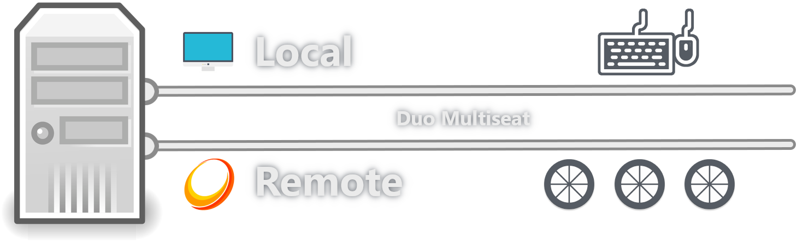

# What is Duo?

Duo is a multiseat suite based around [RdpWrap](https://github.com/sebaxakerhtc/rdpwrap), [Sunshine](https://github.com/DuoStream/Sunshine), [Moonlight](https://github.com/moonlight-stream), and several driver & library patches.  
  
Its main purpose is to streamline and improve self-hosted cloud computer setups by providing each user with their own independent session.

# What is multiseating?
Multiseating is like having multiple people sit at one computer at the same time, each with their own keyboard, mouse, gamepad and monitor.  
  
Every single user can use the computer as if they were the sole user of it, without interfering with each other.  
  
It's like sharing a car but with each person having their own steering wheel and pedals.

# Is Duo available for free?
Patreon supporters enjoy exclusive benefits, including access to additional sessions and the ability to control refresh rates.  
  
All remaining features are accessible to all users.

# What are the minimum requirements?
Any computer capable of running Windows 11 22H2 or newer should be compatible.  
  
The overall system requirements will rise or fall with the number of concurrent users though.

## Additional requirements for gamepad support
Gamepad support is facilitated through [ViGEmBus](https://github.com/nefarius/ViGEmBus/releases/latest), which creates virtual gamepads, and [HidHide](https://github.com/nefarius/HidHide/releases/latest), which organizes them into their respective sessions.

Both must be installed before using Duo to ensure proper gamepad functionality.

# My Antivirus software claims to have found a virus, what's going on?
Duo performs several actions that Windows typically discourages.  
Consequently, many antivirus programs may quickly raise concerns.  
  
Here's a list of activities undertaken by Duo that might trigger suspicion from your antivirus software:
- It adds selected local user accounts to the "Remote Desktop Users" group so they can be used as headless session logon accounts
- It patches termsrv.dll (in RAM) to enable the possibility of running multiple concurrent active sessions
- It patches RdpIdd.dll (in RAM) to enable the possibility of capturing uncompressed SwapChain frames
- It modifies xinput*.dll (on Disk) to segregate gamepad input for each session, preventing interference between them
- It initiates headless localhost RDP sessions to prompt termsrv.dll to create a new session

# Tips & Tricks

## Offloading the encoder workload onto integrated graphics
Unlike regular builds of Sunshine, which rely on DXGI screen duplication, Duo's implementation is based on shared buffers, which means that one GPU can produce the image, while another GPU can be used to encode the image into a video stream.  
  
This grants us the unique opportunity to offload video encoding onto integrated graphics, freeing up resources on our dedicated graphics card, putting the otherwise unused integrated graphics to good use and allowing us to host more instances than we normally could.  
  
To move encoder workloads across GPU boundaries set your "Force a Specific Encoder" setting to...
- "Intel QuickSync" to offload the encoder workload onto the first Intel GPU on your system
- "AMD AMF/VCE" to offload the encoder workload onto the first AMD GPU on your system
- "NVIDIA NVENC" to offload the encoder workload onto the first NVidia GPU on your system

# Known issues and workarounds

## Microsoft accounts not working right
Microsoft accounts appear as local accounts to most Windows operating system components but fail to authenticate via Network Level Authentication.  
  
This poses a problem as that is the authentication method Duo uses to spawn additional sessions.  
  
As such it's recommended to create one, or more, dedicated local user accounts for use with Duo.  
  
The easiest way to do so is to open an administrative cmd.exe command line and execute the following two commands (with slight adjustments to fit your wanted username and password):

```
net user "<username>" "<password>" /add /passwordchg:no
net localgroup administrators "<username>" /add
```

## Windows Updates potentially breaking Duo
While it's impossible for me to anticipate how future Windows Updates could affect Duo, past experiences have shown us that this is a definite possibility.  
  
The two parts that seem to break most often, are either the termsrv.dll or RdpIdd.dll patches.  
  
The termsrv.dll patches are provided by [RdpWrap](https://github.com/sebaxakerhtc/rdpwrap) and can be updated by executing "C:\\Program Files\\RDP Wrapper\\RDP\_CnC.exe" and clicking on "Update INI".  
  
The RdpIdd.dll patches are bundled with Duo and can be updated by updating Duo itself.  
  
Please uninstall previous Duo versions prior to installing new ones.

## Global-exclusive applications
While each user is provided their own dedicated session, it's important to acknowledge that ultimately, you are operating on a single computer, which comes with both its benefits and drawbacks.  
  
You'll be sharing common resources such as processing capacity, the registry, storage space, and more.  
This can pose a problem with system-global-exclusive processes, like Steam, that claim to not support running multiple instances on a single computer.  
  
To address this limitation, it is highly recommended to employ [Sandboxie-Plus](https://github.com/sandboxie-plus/Sandboxie/releases/latest).  
This tool allows you to isolate and sandbox problematic processes, like Steam, into their individual segregated environments, making them believe they got the computer all to themselves.  
  
This, in turn, enables you to initiate multiple instances of such applications, effectively circumventing these artificial restrictions.

# Downloads
- [Free version](https://github.com/DuoStream/Duo/raw/main/Duo.exe)
- [Full version](https://www.patreon.com/posts/duo-1-pc-users-89568993)
